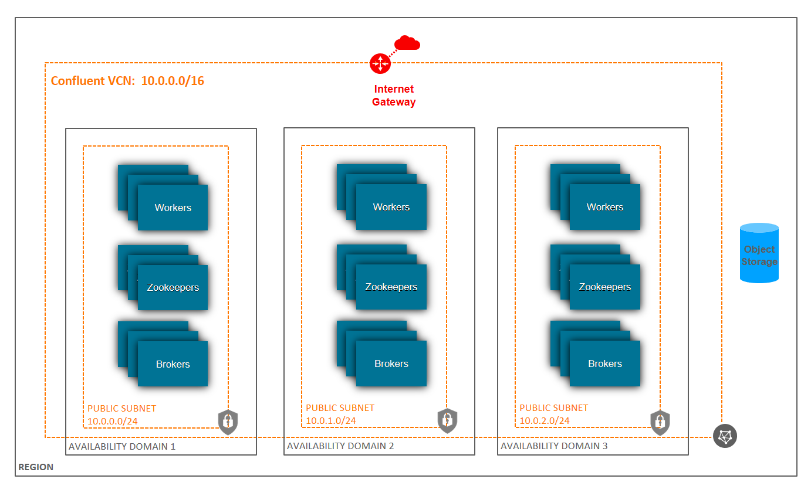
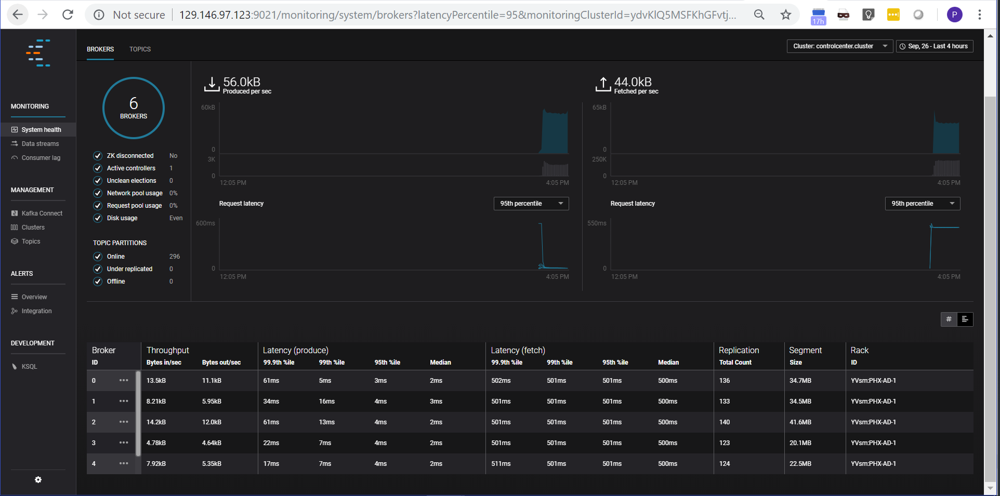

# oci-confluent
Included here are Terraform template to deploy Confluent Platform on Oracle Cloud Infrastructure (OCI) in a single AD (Availability Domain/Zone) or  Multi-AD (high availablilty).  Instructions on how to use it are below. 

## Custom (N-Node) in single AD
OCI supports [N-Node](https://github.com/cloud-partners/oci-confluent/tree/master/N-Node) Confluent platform implementation. This template deploys multiple instances of brokers, workers and zookeeper nodes.  Out of the box, Terraform template deploys 3 Broker nodes and 2 Workers nodes. Zookeeper is also deployed on Broker nodes.  The template supports deploying Zookeeper on its dedicated nodes, if required. OCI Object Storage is used to store the deployment scripts which will be pulled by each instance as part of the initialization to deploy Confluent platform.  OPTIONAL: If you would like to customize the scripts,  you can do so and then upload the updated scripts to a bucket in your account and update [boot.sh.tpl](https://github.com/cloud-partners/oci-confluent/blob/master/scripts/boot.sh.tpl) to point to the URL for your bucket.   

Single AD Architecture:

## N-Node Multi AD for High Availability
[N-Node-Multi-AD](https://github.com/cloud-partners/oci-confluent/tree/master/N-Node-Multi-AD) contains terraform template to deploy Confluent platform across 3 Availability domains (ADs) for high availability. 

Multi-AD Architecture;

## Prerequisites
In addition to an active tenancy on OCI, you will need a functional installation of Terraform, and an API key for a privileged user in the tenancy.  See these documentation links for more information:

[Getting Started with Terraform on OCI](https://docs.cloud.oracle.com/iaas/Content/API/SDKDocs/terraformgetstarted.htm)

[How to Generate an API Signing Key](https://docs.cloud.oracle.com/iaas/Content/API/Concepts/apisigningkey.htm#How)

Once the pre-requisites are in place, you will need to copy the templates from this repository to where you have Terraform installed. 

## Clone the Terraform template
Now, you'll want a local copy of this repo.  You can make that with the commands:

    git clone https://github.com/cloud-partners/oci-confluent.git
    cd oci-confluent/N-Node
    ls

Note:  If you plan to deploy Confluent across 3 ADs, then go to N-Node-Multi-AD folder:

    cd oci-confluent/N-Node-Multi-AD
    ls
 

## Update Template Configuration
Update environment variables in config file: [env-vars](https://github.com/cloud-partners/oci-confluent/blob/master/N-Node/env-vars)  to specify your OCI account details like tenancy_ocid, user_ocid, compartment_ocid. Also you can customize Confluent Platform cluster information including  Brokers, Workers and Zookeeper nodes configuration. To source this file prior to installation, either reference it in your .rc file for your shell's or run the following:

        source env-vars

 

## Deployment & Post Deployment

Deploy using standard Terraform commands

        terraform init && terraform plan && terraform apply

When the apply is complete, the infrastructure will be deployed, but cloud-init scripts will still be running as well as scripts to setup cluster and start services.  Those will wrap up asynchronously.  So, it'll be a few more minutes before your cluster is accessible. You can debug deployments by looking at the following log files.  Login as user: opc as shown below in SSH section. Public ip address of all nodes is available on [OCI Web Console Phoenix Region](https://console.us-phoenix-1.oraclecloud.com/a/compute/instances) / [OCI Web Console Ashburn Region](https://console.us-ashburn-1.oraclecloud.com/a/compute/instances)

 [OCI Web Console](https://console.us-phoenix-1.oraclecloud.com/a/compute/instances)

On each instance, the cloud-init log file location is `/var/log/messages. 	

	sudo less /var/log/messages

To watch cluster installation progress after terraform completes, run the following commands. The public IP will output as a result of the Terraform completion.

	ssh -i ~/.ssh/id_rsa opc@<broker-1 public ip>
	sudo su -
	screen -r

## SSH to Broker Node
When terraform apply is complete, the terminal console will display the public ip address for first broker and worker node.  The default login is opc.  You can SSH into the machine with a command like this:

	1 - BrokerNode 1 SSH login  =   ssh -i ~/.ssh/id_rsa opc@<broker-1 public ip>

	2 - WorkerNode 1 SSH login  =   ssh -i ~/.ssh/id_rsa opc@<worker-1 public ip>

## Confluent Platform Control Center 
You can access Control Center UI using the URL below. The UI will only be available after the cloud-init scripts complete execution, so it will be a few more minutes before it is accessible. The logs are available at /tmp/control-center-logs/control-center.out
 
	
	http://<worker-1 public ip>:9021/

This gives the following output: 

## View the Cluster in OCI Console
You can also login to the web console [here](https://console.us-phoenix-1.oraclecloud.com/a/compute/instances) to view the IaaS that is running the cluster.

Virtual Cloud Network (vcn) page:

Cluster Nodes/Instances page:

