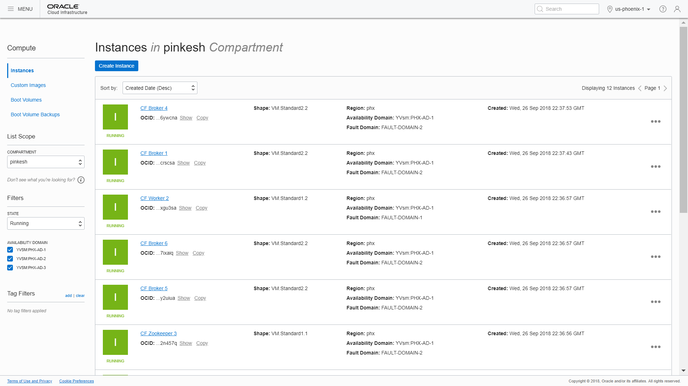

# oci-terraform-dse
[simple](simple) is a Terraform module that will deploy Confluent on OCI.  It supports both the Community and Commercial versions.  Instructions on how to use it are below.

## Prerequisites
First off you'll need to do some pre deploy setup.  That's all detailed [here](https://github.com/cloud-partners/oci-prerequisites).

## Clone the Module
Now, you'll want a local copy of this repo.  You can make that with the commands:

    git clone https://github.com/oci-quickstart/oci-quickstart.git
    cd oci-confluent/terraform
    ls

We now need to initialize the directory with the module in it.  This makes the module aware of the OCI provider.  You can do this by running:

    terraform init

This gives the following output:

## Deploy
Now for the main attraction.  Let's make sure the plan looks good:

    terraform plan

That gives:

If that's good, we can go ahead and apply the deploy:

    terraform apply

You'll need to enter `yes` when prompted.  The apply should take about five minutes to run.  Once complete, you'll see something like this:

When the apply is complete, the infrastructure will be deployed, but cloud-init scripts will still be running.  Those will wrap up asynchronously.  The cluster might take ten minutes.  Now is a good time to get a coffee.

## Login to Confluent Control Center
You can access Control Center UI using the URL below. The UI will only be available after the cloud-init scripts complete execution, so it will be a few more minutes before it is accessible. The logs are available at /tmp/control-center-logs/control-center.out

	http://<worker-1 public ip>:9021/

This gives the following output:

## View the Cluster in OCI Console
You can also login to the web console [here](https://console.us-phoenix-1.oraclecloud.com/a/compute/instances) to view the IaaS that is running the cluster.

Virtual Cloud Network (vcn) page:

Cluster Nodes/Instances page:

## How to integration with Oracle Object Storage
Integration-with-Oracle-Object-Storage
Detailed steps are document [here](https://github.com/cloud-partners/oci-confluent/blob/master/Integration-with-Oracle-Object-Storage/README.md)
