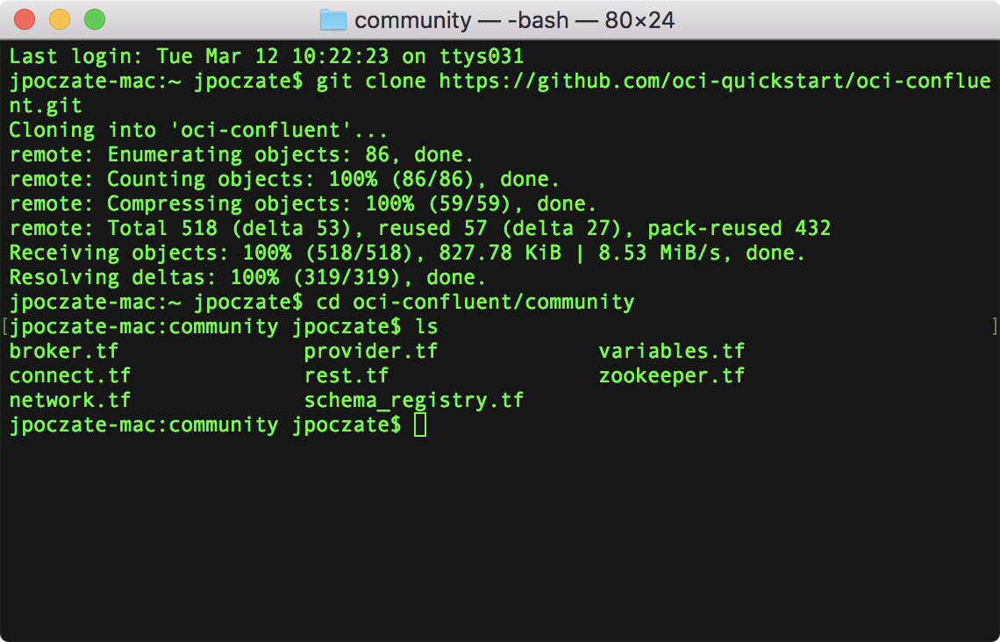
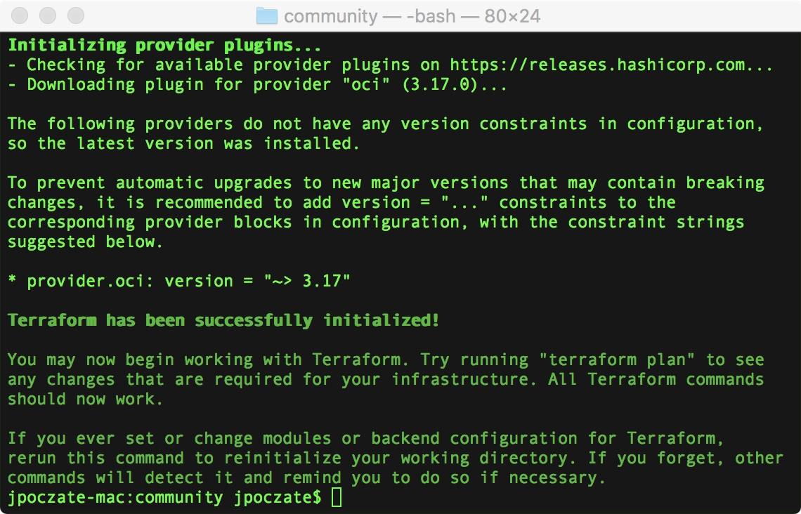
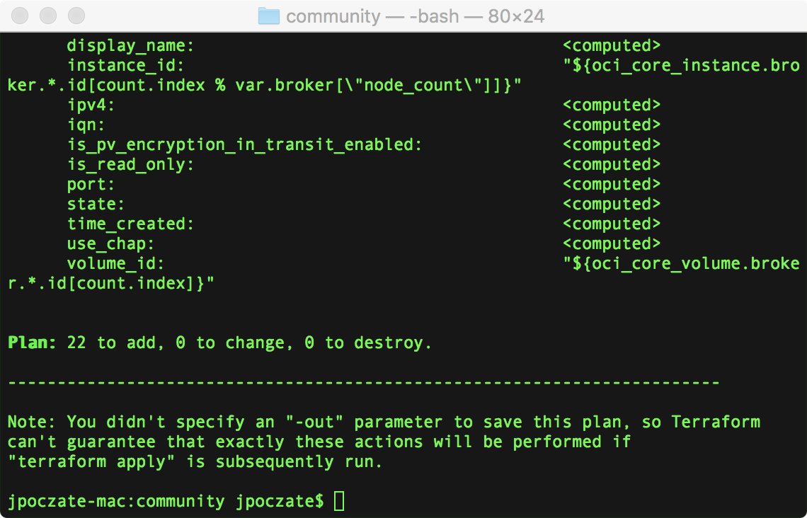
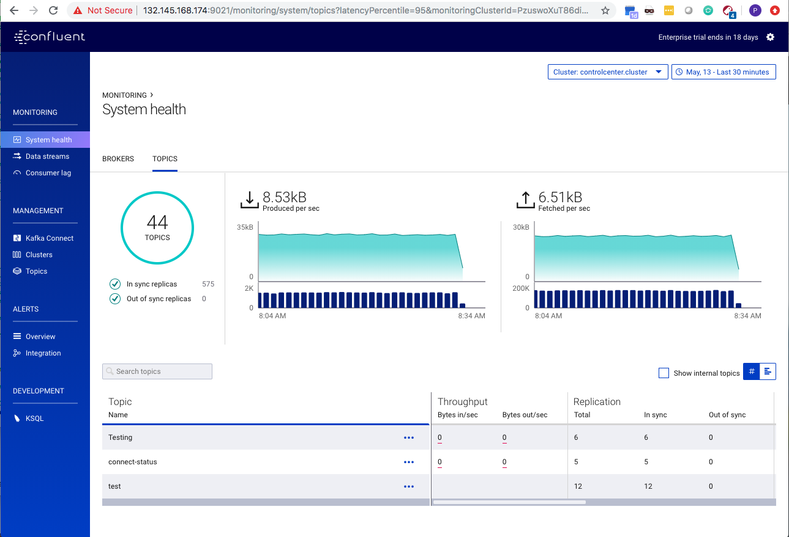
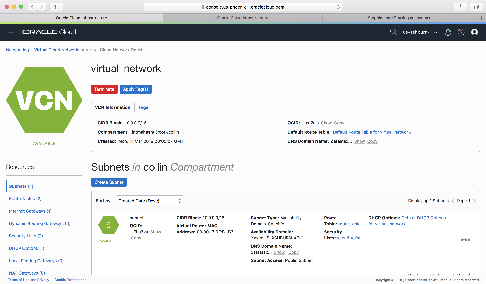
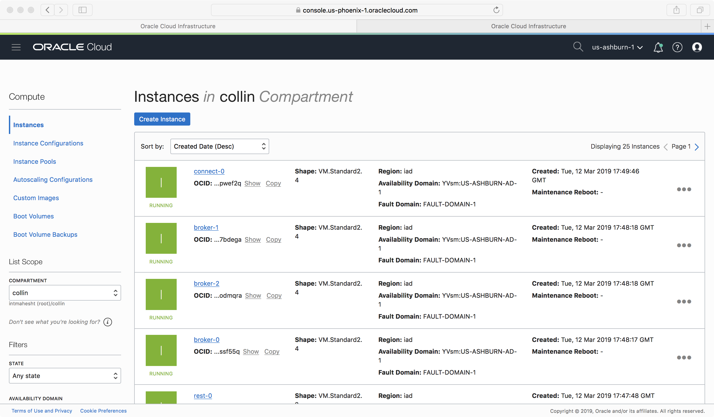

# oci-quickstart-confluent
These are Terraform modules that deploy [Confluent Platform](https://www.confluent.io/product/confluent-platform/) on [Oracle Cloud Infrastructure (OCI)](https://cloud.oracle.com/en_US/cloud-infrastructure).  They are developed jointly by Oracle and Confluent.

* [community](community) deploys the Community Edition
* [enterprise](enterprise) deploys the Enterprise Edition

## Architecture

## Prerequisites
First off you'll need to do some pre deploy setup.  That's all detailed [here](https://github.com/cloud-partners/oci-prerequisites).

## Clone the Module
Now, you'll want a local copy of this repo.  You can make that with the commands:

    git clone https://github.com/oracle/oci-quickstart-confluent.git

If you want to deploy community edition:

    cd oci-quickstart-confluent/community
    ls
    
If you want to deploy enterprise edition (comes with 30 day free trial):

    cd oci-quickstart-confluent/enterprise
    ls

We now need to initialize the directory with the module in it.  This makes the module aware of the OCI provider.  You can do this by running:

    terraform init

This gives the following output:

## Deploy
Now for the main attraction.  Let's make sure the plan looks good:

    terraform plan

That gives:

This command details what will be deployed based on the `variables.tf` file.
If that's good, we can go ahead and apply the deploy:

    terraform apply

You'll need to enter `yes` when prompted.  The apply should take about five minutes to run.  Once complete, you'll see something like this:

#### For Community Edition

#### For Enterprise Edition

When the apply is complete, the infrastructure will be deployed, but cloud-init scripts will still be running.  Those will wrap up asynchronously.  The cluster might take ten minutes.  Now is a good time to get a coffee.

The outputs of the deploy list the public ips of all the deployed instances.
You can ssh into any of the instances by running a command like:
`ssh -i ~/.ssh/oci opc@<instance ip>`

## Confluent Control Center (Only in Enterprise edition) 

## View the Cluster in OCI Console
You can also login to the web console [here](https://console.us-phoenix-1.oraclecloud.com/a/compute/instances) to view the IaaS that is running from the
deployment.

Virtual Cloud Network (vcn) page:

Instances page:

## Create Topic, Produce & Consume messages
Let's test the cluster 

#### Create Topic
Login to a broker instance:  ssh opc@<broker_instance>.   If you install Enterprise edition,  you can also create a topic through the Confluent Control Center Web Console.  

    [opc@broker-0 opc]# /usr/bin/kafka-topics --zookeeper zookeeper-0:2181 --create --topic demo --partitions 1 --replication-factor 3

#### Produce Messages
Add a few messages to the topic. I am using the REST API to publish 10 messages, so it can be done from any machine which has access to Kafka REST API endpoint. 

Example:
    
    export RPURL=http://rest-0:8082
    [opc@connect-0 log]# curl -X POST -H "Content-Type: application/vnd.kafka.json.v1+json"  --data '{"records":[{"value":{"foo":"bar"}}]}' $RPURL/topics/demo

#### Consume Messages
Create consumer instance: 

    curl -X POST -H "Content-Type: application/vnd.kafka.v1+json" --data '{"name": "ext_consumer_demo","format": "json", "auto.offset.reset": "smallest"}' $RPURL/consumers/c1

Consume messages

    curl -X GET -H "Accept: application/vnd.kafka.json.v1+json" $RPURL/consumers/c1/instances/ext_consumer_demo/topics/demo
